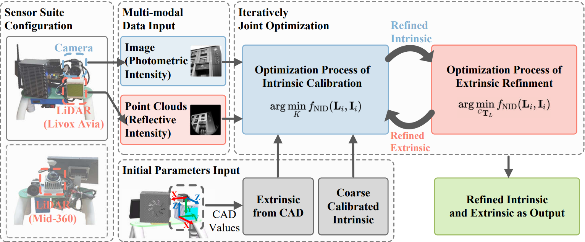
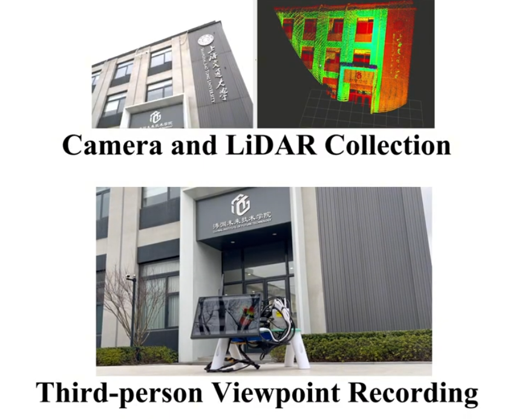

# Joint_Direct_LiDAR_Camera_Calibration

## Direct, Targetless and Automatic Joint Calibration of LiDAR-Camera Intrinsic and Extrinsic

### News

- 🎉 **2025-06-15**:  **Accepted by IROS '25!** **Congratulations!**
- 📢 **2025-03-02**:  **Submitted to IROS '25!**

## 1. Introduction

This packgage presents a direct, targetless, and automatic LiDAR-camera joint calibration method that effectively overcomes the intrinsic precision limitations and optimizes extrinsic while maintaining CAD specification consistency.

### 1.1 Overview

<div align="center">
    
</div>

### 1.2 Related Video

You can download our High-definited video from the [**Geogle Link**](https://drive.google.com/file/d/1w1GhRpAkfbL3mwY6MtnTWDE880ACQ6BN/view?usp=drive_link) to gain more detailed insights into this work.

### 1.3 Pdf

You can download the pdf format from the link below:

[Download PDF](pics/iros25.pdf)

### 1.4 Related Self-integrated Dataset

Our self-integrated dataset [**LiDAR_Camera_Data**](https://drive.google.com/file/d/1ZrnEVT-IEMSipSpJhIkiJ8cF-CXso1HO/view?usp=sharing) which simultaneously incorporates synchronized LiDAR and camera data, is also publicly available online for benchmarking and evaluation purposes.

### 1.5 Related Work

This work builds upon and enhances the methodology for extrinsic calibration introduced by Koide et al. [[1]](#1), providing improved accuracy for both intrinsic and extrinsic calibration mothod in real-world applications.

## 2. Prerequisited

### 2.1 Ubuntu and ROS

Ubuntu 20.04 and ROS. 
Follow [ROS Installation](http://wiki.ros.org/ROS/Installation).

### 2.2 OpenCV
Follow [OpenCV Installation](https://opencv.org/). 

### 2.3 PCL

`We recommended to use PCL (Point Cloud Library) version ≥ 1.10.`

Follow [PCL Installation](https://pointclouds.org/). 

### 2.4 Eigen

Follow [Eigen Installation](https://eigen.tuxfamily.org/). 


## 3. Install Common Dependencies

### 3.1 Install required dependencies:

```bash
sudo apt install libomp-dev libboost-all-dev libglm-dev libglfw3-dev libpng-dev libjpeg-dev liblapack-dev libsuitesparse-dev libcxsparse3 libgflags-dev libgoogle-glog-dev libgtest-dev
```

**Python:**
```bash
pip3 install numpy opencv-python torch matplotlib
```

### 3.2 Install GTSAM:

```bash
git clone https://github.com/borglab/gtsam
cd gtsam && git checkout 4.2a9
mkdir build && cd build
cmake .. -DGTSAM_BUILD_EXAMPLES_ALWAYS=OFF \
         -DGTSAM_BUILD_TESTS=OFF \
         -DGTSAM_WITH_TBB=OFF \
         -DGTSAM_BUILD_WITH_MARCH_NATIVE=OFF
make -j$(nproc)
sudo make install
```

### 3.3 Install Iridescence to visualize the Calibration Result:

```bash
git clone https://github.com/koide3/iridescence --recursive
cd iridescence
mkdir build && cd build
cmake .. -DCMAKE_BUILD_TYPE=Release
make -j$(nproc)
sudo make install
```

### 3.4 Install Ceres-Solver:

`Note: We requires Ceres-Solver v2.2.0.`

```bash
wget ceres-solver.org/ceres-solver-2.2.0.tar.gz
tar zxf ceres-solver-2.2.0.tar.gz
cd ceres-solver-2.2.0
mkdir build && cd build
cmake ..
make -j$(nproc)
sudo make install
```

### 3.5 Install Sophus:

```bash
git clone https://github.com/strasdat/Sophus.git
cd Sophus
mkdir build && cd build
cmake ..
make -j$(nproc)
sudo make install
```

### 3.5 Install SuperGlue:

```bash
git clone https://github.com/magicleap/SuperGluePretrainedNetwork.git
echo 'export PYTHONPATH=$PYTHONPATH:/path/to/SuperGluePretrainedNetwork' >> ~/.bashrc
source ~/.bashrc
```

## 🚀4. Start Calibration🚀

### 4.1 Download Dataset:
Download the dataset into the directory defined by `<YOUR_BAG_PATH>`:

**Tips:** You can place multiple bag files in `<YOUR_BAG_PATH>`. Doing so may improve the calibration accuracy.

[**LiDAR_Camera_Data**](https://drive.google.com/file/d/1ZrnEVT-IEMSipSpJhIkiJ8cF-CXso1HO/view?usp=sharing) 

### 4.2 Build:

Create your catkin workspace. Cloning the package and catkin_make:

```
mkdir -p catkin_ws/src
cd ~/catkin_ws/src
git clone https://github.com/sys111111/Joint_Direct_LiDAR_Camera_Calibration.git
## Alternatively, you can simply place this package directly into the src folder of your catkin workspace. ##
cd ../
catkin_make
```

catkin_ws is your own workspace.

### 4.3 Preprocessing the LiDAR and Camera Data:

**Note:** Before running the command, please note:  
- **`camera_model plumb_bob`**: only the pinhole model is supported at this package version, so we specify `plumb_bob`.  
- **`camera_intrinsics 0,0,0,0`** & **`camera_distortion_coeffs 0,0,0,0,0`**: have been initialized to zero. These values will be updated with actual calibration data in subsequent commands.
- **`<YOUR_BAG_PATH>`**: replace with the path to your own bag directory.  
- **`<YOUR_OUTPUT_PATH>`**: replace with your own output folder (it will be created automatically if it doesn’t exist).

```
source ~/catkin_ws/devel/setup.bash
rosrun joint_calibration preprocess \
  -av \
  --camera_model plumb_bob \
  --camera_intrinsics 0,0,0,0 \
  --camera_distortion_coeffs 0,0,0,0,0 \
  <YOUR_BAG_PATH> \
  <YOUR_OUTPUT_PATH>
```

### 4.4 Superglue Match For Initial Intrinsic Guess

```
source ~/catkin_ws/devel/setup.bash
rosrun joint_calibration superglue_matches.py \
  <YOUR_OUTPUT_PATH> \
  --rotate_camera 0
```

### 4.5 Initial Extrinsic Guess from CAD

Before running this command, prepare your CAD-derived Camera-to-LiDAR extrinsic transform (`<LiDAR_T_Camera>`) in the 7-element quaternion format: [tx, ty, tz, qx, qy, qz, qw], 
where the first three entries (`tx, ty, tz`) are the translation (in meters) and the last four (`qx, qy, qz, qw`) are the rotation quaternion.

`[0.05643, 0.00039, 0.06362, -0.5, 0.5, -0.5, 0.5]` is the initial extrinsic for our CAD model in the example dataset. In the example `[0.05643, 0.00039, 0.06362, -0.5, 0.5, -0.5, 0.5]` below:

- **Translation** = `[0.05643, 0.00039, 0.06362]`  
- **Rotation (qx, qy, qz, qw)** = `[-0.5, 0.5, -0.5, 0.5]`

```
source ~/catkin_ws/devel/setup.bash
rosrun joint_calibration initial_extrinsic.py \
  <LiDAR_T_Camera> \
  --data_path <YOUR_OUTPUT_PATH>
```

### 4.6 Initial Intrinsic Guess From SuperGlue

```
source ~/catkin_ws/devel/setup.bash
rosrun joint_calibration initial_guess_auto \
  <YOUR_OUTPUT_PATH>
```

**Recommendation**: If subsequent optimization fails to converge using these intrinsic From SuperGlue, it is recommended to replace them with initial values obtained from the **target-based** (such as checkerboard) method.

In the example dataset, the intrinsic parameters and distortion coefficients obtained using the target-based method are shown below:

- **Intrinsic Parameters** = `[1273.533320584207, 1276.5867266684963, 630.1371606171485, 526.5235964406237]`  
- **Distortion Coefficients** = `[-0.089167804993, 0.13391534789, -0.00291694989, -0.00229012, 0.0]`

### 4.7 Intrinsic Calibration Optimization

```
source ~/catkin_ws/devel/setup.bash
rosrun joint_calibration intrinsics_calibrate \
  <YOUR_OUTPUT_PATH>
```

**Note:** The optimized camera intrinsics are saved in the `calib.json` file, under the fields `"intrinsics_final_results"` and `"distortion_coeffs_final_results"`. You should manually replace the original `"intrinsics"` and `"distortion_coeffs"` entries with these optimized values to proceed with extrinsic calibration using the refined intrinsics.

### 4.8 Extrinsic Calibration Optimization

```
source ~/catkin_ws/devel/setup.bash
rosrun joint_calibration extrinsics_calibrate \
  <YOUR_OUTPUT_PATH>
```

**Note:** The optimized LiDAR–camera extrinsics are stored in the `calib.json` file under the `"T_lidar_camera"` field. You should manually replace the original `"init_T_lidar_camera"` entry with these optimized values to serve as the starting extrinsics for subsequent refinement iterations.

### 4.9 Iteratively Joint Optimization

Repeat steps 4.7 and 4.8, assessing convergence by the LiDAR–camera colorized results in the visualization tool and the normalized information distance (NID) values. 

**Note:** In our experiments, 2–4 iterations were sufficient to reach convergence.

##  🛠️5. Self-Data Collection

### 📌5.1 Procedure

- **Initialize:** 
Place the sensor on a stable surface and keep it stably motionless. Begin recording the following ROS topics: 
-`Image` 
-`PointCloud2` 
-(Optional) `CameraInfo`

- **Capture Sequence:**  
**LiDAR (e.g., Livox Avia):**  Keep the sensor stationary for **10–15 s**.

- **Finalize**  
Stop recording all topics. Proceed with data validation and downstream processing.

### 📌5.2 Note
- Ensure the sensor remains perfectly still at the start of each ROS bag capture so that the first point cloud and image share the exact same pose.  
- Verify that the LiDAR’s intensity channel contains meaningful texture and geometry information—some devices (e.g., Livox Avia) may report invalid intensity for very close returns.

### 5.3 Example
Data collection example for Livox Avia:

<div align="center">
    
</div>

## 6. License && Contact

The source code of this package is released under the MIT license. If you have any problems, please contact the author at <sys2048194132@sjtu.edu.cn>

## **References**

<a id="1">[1]</a> K. Koide, S. Oishi, M. Yokozuka, and A. Banno, “General, single-shot, target-less, and automatic lidar-camera extrinsic calibration toolbox,” in 2023 IEEE International Conference on Robotics and Automation (ICRA), IEEE, 2023, pp. 11301–11307.